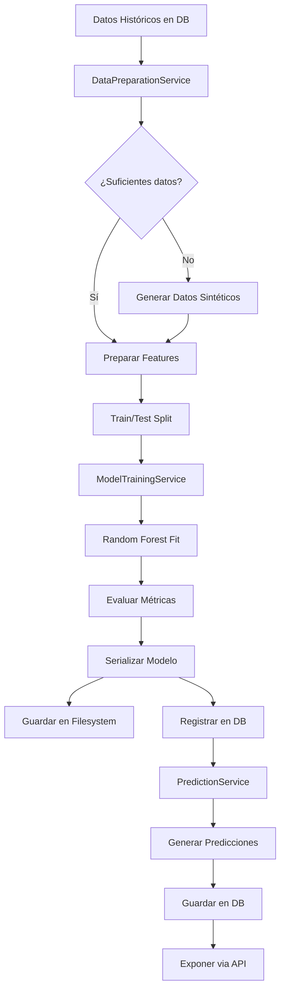

# 🔬 Sistema de IA Predictiva - Documentación Técnica Detallada

## Tabla de Contenidos

1. [Arquitectura del Sistema](#arquitectura)
2. [Algoritmo: Random Forest Regressor](#algoritmo)
3. [Pipeline de Datos](#pipeline)
4. [Features Engineering](#features)
5. [Entrenamiento del Modelo](#entrenamiento)
6. [Evaluación y Métricas](#metricas)
7. [Serialización y Persistencia](#serializacion)
8. [API Endpoints](#endpoints)
9. [Optimización y Escalabilidad](#optimizacion)
10. [Troubleshooting](#troubleshooting)

---

<a name="arquitectura"></a>

## 1. Arquitectura del Sistema

### Stack Tecnológico

```
┌─────────────────────────────────────────────────────────┐
│                    FRONTEND (React)                     │
│  - Recharts/Chart.js para visualización                │
│  - Axios para consumir API                              │
└─────────────────────┬───────────────────────────────────┘
                      │ HTTP/REST
┌─────────────────────▼───────────────────────────────────┐
│              BACKEND (Django REST)                      │
│  - ViewSets para endpoints                              │
│  - Serializers para validación                          │
└─────────────────────┬───────────────────────────────────┘
                      │
┌─────────────────────▼───────────────────────────────────┐
│           CAPA DE SERVICIOS (apps/ai/services/)         │
│  ┌──────────────────────────────────────────────────┐  │
│  │  data_preparation.py                             │  │
│  │  - Extracción de datos históricos                │  │
│  │  - Generación de datos sintéticos                │  │
│  │  - Feature engineering                           │  │
│  └──────────────────────────────────────────────────┘  │
│                                                          │
│  ┌──────────────────────────────────────────────────┐  │
│  │  model_training.py                               │  │
│  │  - Entrenamiento de Random Forest                │  │
│  │  - Evaluación de métricas                        │  │
│  │  - Serialización con joblib                      │  │
│  └──────────────────────────────────────────────────┘  │
│                                                          │
│  ┌──────────────────────────────────────────────────┐  │
│  │  prediction.py                                   │  │
│  │  - Carga de modelo activo                        │  │
│  │  - Generación de predicciones                    │  │
│  │  - Validación posterior                          │  │
│  └──────────────────────────────────────────────────┘  │
└─────────────────────┬───────────────────────────────────┘
                      │
┌─────────────────────▼───────────────────────────────────┐
│               BASE DE DATOS (PostgreSQL)                │
│  - apps_ai_mlmodel (historial de modelos)              │
│  - apps_ai_prediccionventas (predicciones)             │
│  - apps_orders_pedido (datos históricos)               │
│  - apps_orders_detallepedido (items vendidos)          │
└─────────────────────────────────────────────────────────┘
                      │
┌─────────────────────▼───────────────────────────────────┐
│            FILESYSTEM (models/)                         │
│  - ventas_predictor_v1.0_20251110_143022.pkl          │
│  - ventas_predictor_v1.0_20251109_091533.pkl          │
└─────────────────────────────────────────────────────────┘
```

### Flujo de Datos



---

<a name="algoritmo"></a>

## 2. Algoritmo: Random Forest Regressor

### ¿Por qué Random Forest?

**Ventajas**:

1. ✅ **Robust to overfitting**: Múltiples árboles reducen varianza
2. ✅ **No requiere scaling**: A diferencia de regresión lineal o SVM
3. ✅ **Maneja no-linealidad**: Captura relaciones complejas
4. ✅ **Feature importance**: Identifica variables más relevantes
5. ✅ **Funciona con pocos datos**: No necesita millones de registros
6. ✅ **Maneja datos categóricos**: Via one-hot encoding

**Desventajas** (y por qué no importan aquí):

- ❌ No es interpretable → No necesitamos explicar cada predicción
- ❌ Lento en predicción → Nuestras predicciones son batch, no real-time
- ❌ Grande en tamaño → Aceptable para nuestro caso de uso

### Comparación con Otros Algoritmos

| Algoritmo         | Pros                             | Contras                       | ¿Por qué NO lo usamos?                 |
| ----------------- | -------------------------------- | ----------------------------- | -------------------------------------- |
| **Random Forest** | ✅ Preciso, robusto, fácil       | ❌ Tamaño grande              | **SELECCIONADO**                       |
| Linear Regression | Simple, interpretable            | No captura no-linealidad      | Ventas tienen estacionalidad no-lineal |
| XGBoost           | Muy preciso, rápido              | Complejo, requiere tuning     | Overkill para nuestro caso             |
| LSTM/Neural Net   | Excelente para series temporales | Requiere MUCHOS datos         | Tenemos pocos datos inicialmente       |
| ARIMA             | Clásico para time series         | Solo univariado, sin features | Queremos usar categoría, precio, etc.  |

### Hiperparámetros

```python
RandomForestRegressor(
    n_estimators=100,     # Número de árboles (más = mejor pero más lento)
    max_depth=10,         # Profundidad máxima (evita overfitting)
    random_state=42,      # Reproducibilidad
    n_jobs=-1,            # Usar todos los cores de CPU
    min_samples_split=2,  # Mínimo de muestras para dividir nodo
    min_samples_leaf=1    # Mínimo de muestras en hoja
)
```

**Tuning recomendado**:

- Con **pocos datos** (<500 registros): `n_estimators=50`, `max_depth=5`
- Con **datos normales** (500-5000): `n_estimators=100`, `max_depth=10`
- Con **muchos datos** (>5000): `n_estimators=200`, `max_depth=15`

---

<a name="pipeline"></a>

## 3. Pipeline de Datos

### 3.1 Extracción de Datos

**SQL Query ejecutado** (simplificado):

```sql
SELECT
    dp.pedido__created_at AS fecha,
    pr.id AS producto_id,
    pr.nombre AS producto_nombre,
    cat.nombre AS categoria,
    mar.nombre AS marca,
    dp.precio_unitario,
    dp.cantidad,
    dp.subtotal,
    EXTRACT(MONTH FROM dp.pedido__created_at) AS mes,
    EXTRACT(YEAR FROM dp.pedido__created_at) AS año,
    EXTRACT(DOW FROM dp.pedido__created_at) AS dia_semana,
    ((EXTRACT(MONTH FROM dp.pedido__created_at) - 1) / 3 + 1) AS trimestre
FROM apps_orders_detallepedido dp
JOIN apps_products_prenda pr ON dp.prenda_id = pr.id
JOIN apps_products_marca mar ON pr.marca_id = mar.id
JOIN apps_products_prenda_categorias pc ON pr.id = pc.prenda_id
JOIN apps_products_categoria cat ON pc.categoria_id = cat.id
JOIN apps_orders_pedido ped ON dp.pedido_id = ped.id
WHERE ped.estado IN ('completado', 'enviado', 'entregado')
  AND ped.created_at >= NOW() - INTERVAL '12 months'
ORDER BY ped.created_at DESC;
```

**Output esperado** (DataFrame):

```
       fecha  producto_id categoria  precio_unitario  cantidad  subtotal  mes  año
0 2025-11-10          123  Vestidos            89.99         2    179.98   11  2025
1 2025-11-09          456    Blusas            45.99         1     45.99   11  2025
2 2025-11-08          789  Vestidos            75.50         3    226.50   11  2025
...
```

### 3.2 Generación de Datos Sintéticos

Cuando no hay suficientes datos reales, se generan datos sintéticos con **patrones realistas**:

```python
def _generate_synthetic_data(num_months=12, records_per_month=50):
    # Estacionalidad realista
    estacionalidad = {
        11: 1.5,  # Noviembre: +50% (Black Friday)
        12: 1.5,  # Diciembre: +50% (Navidad)
        6: 1.2,   # Junio: +20% (verano)
        7: 1.2,   # Julio: +20%
        8: 1.2,   # Agosto: +20%
        1: 0.7,   # Enero: -30% (post-navidad)
        2: 0.7    # Febrero: -30%
    }

    # Precios realistas por categoría
    precios_base = {
        'Vestidos': 89.99,
        'Blusas': 45.99,
        'Pantalones': 65.99,
        'Faldas': 55.99
    }

    # Cantidad base: 1-5 unidades por transacción
    cantidad_base = np.random.randint(1, 5)
    cantidad = int(cantidad_base * estacionalidad.get(mes, 1.0))
```

**Distribución generada**:

```
Diciembre: 75 transacciones (150% de base)
Julio:     60 transacciones (120% de base)
Enero:     35 transacciones (70% de base)
```

---

<a name="features"></a>

## 4. Features Engineering

### Features Utilizadas

| Feature             | Tipo     | Descripción                     | Ejemplo |
| ------------------- | -------- | ------------------------------- | ------- |
| `año`               | Numérico | Año de la transacción           | 2025    |
| `mes`               | Numérico | Mes (1-12)                      | 11      |
| `mes_sin`           | Numérico | sin(2π \* mes / 12)             | 0.866   |
| `mes_cos`           | Numérico | cos(2π \* mes / 12)             | -0.5    |
| `trimestre`         | Numérico | Trimestre (1-4)                 | 4       |
| `precio_promedio`   | Numérico | Precio promedio de la categoría | 65.99   |
| `num_transacciones` | Numérico | Número de ventas                | 50      |
| `cat_Vestidos`      | Binario  | One-hot encoding                | 1 o 0   |
| `cat_Blusas`        | Binario  | One-hot encoding                | 1 o 0   |
| `cat_Pantalones`    | Binario  | One-hot encoding                | 1 o 0   |
| `cat_Faldas`        | Binario  | One-hot encoding                | 1 o 0   |

### ¿Por qué sin/cos para mes?

**Problema**: El mes es **cíclico**: después de diciembre (12) viene enero (1). Si usamos mes directo, el modelo pensaría que enero está "lejos" de diciembre.

**Solución**: Transformación trigonométrica

```python
mes_sin = np.sin(2 * np.pi * mes / 12)
mes_cos = np.cos(2 * np.pi * mes / 12)
```

**Visualización**:

```
Mes:     1    2    3    4    5    6    7    8    9   10   11   12
mes_sin: 0.5  0.9  1.0  0.9  0.5  0.0 -0.5 -0.9 -1.0 -0.9 -0.5  0.0
mes_cos: 0.9  0.5  0.0 -0.5 -0.9 -1.0 -0.9 -0.5  0.0  0.5  0.9  1.0

Enero y Diciembre tienen valores similares (ciclicidad capturada)
```

### Agregación de Datos

Los datos se agregan por **(año, mes, categoría)**:

```python
df_agg = df.groupby(['año', 'mes', 'categoria']).agg({
    'cantidad': 'sum',           # Total vendido
    'subtotal': 'sum',           # Total de ingresos
    'precio_unitario': 'mean',   # Precio promedio
    'producto_id': 'count'       # Número de transacciones
}).reset_index()
```

**Ejemplo**:

```
Input (raw):
  fecha       categoria  cantidad  precio
  2025-11-01  Vestidos   2         89.99
  2025-11-02  Vestidos   1         85.00
  2025-11-03  Vestidos   3         90.00

Output (aggregated):
  año  mes  categoria  cantidad_vendida  precio_promedio  num_transacciones
  2025 11   Vestidos   6                 88.33            3
```

---

<a name="entrenamiento"></a>

## 5. Entrenamiento del Modelo

### Pipeline Completo

```python
# 1. Obtener datos
df = data_service.get_historical_sales_data(months_back=12)

# 2. Preparar features
X, y, feature_columns = data_service.prepare_features(df)

# 3. Split train/test
X_train, X_test, y_train, y_test = train_test_split(
    X, y, test_size=0.2, random_state=42
)

# 4. Entrenar modelo
model = RandomForestRegressor(n_estimators=100, max_depth=10, random_state=42)
model.fit(X_train, y_train)

# 5. Evaluar
y_pred = model.predict(X_test)
r2 = r2_score(y_test, y_pred)
mae = mean_absolute_error(y_test, y_pred)
mse = mean_squared_error(y_test, y_pred)
rmse = np.sqrt(mse)
```

### Validación Cruzada (Opcional)

Para mayor robustez:

```python
from sklearn.model_selection import cross_val_score

scores = cross_val_score(
    model, X, y,
    cv=5,  # 5-fold cross-validation
    scoring='r2'
)

print(f"R² promedio: {scores.mean():.3f} (+/- {scores.std() * 2:.3f})")
```

---

<a name="metricas"></a>

## 6. Evaluación y Métricas

### MAE (Mean Absolute Error)

**Fórmula**:

$$
MAE = \frac{1}{n} \sum_{i=1}^{n} |y_i - \hat{y}_i|
$$

**Interpretación**:

- MAE = 5 → "En promedio, me equivoco en 5 unidades"
- **Más bajo es mejor**
- Fácil de interpretar (misma unidad que el target)

**Ejemplo**:

```
Predicción: [100, 120, 150]
Real:       [105, 110, 160]
Errores:    [5, 10, 10]
MAE = (5 + 10 + 10) / 3 = 8.33
```

### RMSE (Root Mean Squared Error)

**Fórmula**:

$$
RMSE = \sqrt{\frac{1}{n} \sum_{i=1}^{n} (y_i - \hat{y}_i)^2}
$$

**Interpretación**:

- Similar al MAE pero **penaliza más los errores grandes**
- RMSE siempre ≥ MAE
- Si RMSE >> MAE, hay outliers en las predicciones

**Ejemplo**:

```
Errores: [5, 10, 10]
MSE = (25 + 100 + 100) / 3 = 75
RMSE = √75 = 8.66
```

### R² Score (Coeficiente de Determinación)

**Fórmula**:

$$
R^2 = 1 - \frac{SS_{res}}{SS_{tot}} = 1 - \frac{\sum (y_i - \hat{y}_i)^2}{\sum (y_i - \bar{y})^2}
$$

**Interpretación**:

- **R² = 1.0**: Predicción perfecta
- **R² = 0.8**: El modelo explica 80% de la variabilidad
- **R² = 0.0**: El modelo no es mejor que predecir el promedio
- **R² < 0.0**: El modelo es peor que predecir el promedio

**Calidad según R²**:

```
R² > 0.9  → Excelente
R² > 0.7  → Bueno
R² > 0.5  → Aceptable
R² < 0.5  → Malo (re-entrenar o revisar features)
```

### Feature Importance

Random Forest permite ver qué features son más importantes:

```python
feature_importance = pd.DataFrame({
    'feature': feature_columns,
    'importance': model.feature_importances_
}).sort_values('importance', ascending=False)

print(feature_importance.head(10))
```

**Output esperado**:

```
          feature  importance
0         mes_sin      0.3521
1         mes_cos      0.2874
2  cat_Vestidos        0.1532
3  precio_promedio     0.0982
4         trimestre    0.0765
```

**Interpretación**: `mes_sin` es la feature más importante (35% de influencia), lo que confirma que la **estacionalidad** es clave.

---

<a name="serializacion"></a>

## 7. Serialización y Persistencia

### Guardado del Modelo

```python
import joblib
from datetime import datetime

# Preparar datos a guardar
model_data = {
    'model': model,                      # Modelo entrenado
    'feature_columns': feature_columns,  # Orden de features
    'version': 'v1.0_20251110_143022',
    'trained_at': datetime.now().isoformat(),
    'scaler': None  # Si se usara normalización
}

# Guardar
model_path = 'models/ventas_predictor_v1.0_20251110_143022.pkl'
joblib.dump(model_data, model_path, compress=3)  # compress=3 para ahorrar espacio
```

### Carga del Modelo

```python
def load_active_model():
    # 1. Obtener modelo activo de BD
    ml_model = MLModel.objects.filter(activo=True).latest('fecha_entrenamiento')

    # 2. Cargar archivo
    model_data = joblib.load(ml_model.archivo_modelo)

    return (
        ml_model,                        # Registro de BD
        model_data['model'],             # Modelo sklearn
        model_data['feature_columns']    # Columnas esperadas
    )
```

### Versionado

Cada modelo se versiona automáticamente:

```
models/
├── ventas_predictor_v1.0_20251110_143022.pkl  (3.2 MB)
├── ventas_predictor_v1.0_20251109_091533.pkl  (3.1 MB)
└── ventas_predictor_v1.0_20251108_183012.pkl  (2.9 MB)
```

**Esquema de versionado**:

```
v{major}.{minor}_{timestamp}

v1.0 = Primera versión
v1.1 = Mejora menor (más features)
v2.0 = Cambio mayor (nuevo algoritmo)
```

---

<a name="endpoints"></a>

## 8. API Endpoints

### 8.1 Dashboard Completo

```http
GET /api/ai/dashboard/
```

**Query Params**:

- `months_back=6` (opcional): Meses históricos
- `months_forward=3` (opcional): Meses futuros

**Response**:

```json
{
  "historical": [
    { "periodo": "2025-05", "cantidad_vendida": 120, "total_ventas": 10500.5 },
    { "periodo": "2025-06", "cantidad_vendida": 135, "total_ventas": 12200.0 }
  ],
  "predictions": [
    {
      "periodo": "2025-12",
      "ventas_predichas": 185.5,
      "categoria": "Total",
      "mes": 12,
      "año": 2025
    },
    {
      "periodo": "2026-01",
      "ventas_predichas": 92.3,
      "categoria": "Total",
      "mes": 1,
      "año": 2026
    }
  ],
  "predictions_by_category": [
    { "periodo": "2025-12", "ventas_predichas": 95.2, "categoria": "Vestidos" },
    { "periodo": "2025-12", "ventas_predichas": 45.8, "categoria": "Blusas" }
  ],
  "top_products": [
    {
      "prenda__nombre": "Vestido Floral",
      "total_vendido": 50,
      "ingresos_totales": 4500.0
    }
  ],
  "category_sales": [
    {
      "categoria": "Vestidos",
      "total_ventas": 25000.0,
      "cantidad_vendida": 300
    }
  ],
  "model_info": {
    "version": "v1.0_20251110_143022",
    "trained_at": "2025-11-10T14:30:22",
    "r2_score": 0.82,
    "mae": 8.5
  }
}
```

### 8.2 Predecir Ventas

```http
POST /api/ai/predictions/sales-forecast/
Content-Type: application/json

{
  "categoria": "Vestidos",  // opcional
  "n_months": 3
}
```

**Response**:

```json
{
  "predictions": [
    {
      "periodo": "2025-12",
      "ventas_predichas": 95.2,
      "categoria": "Vestidos",
      "mes": 12,
      "año": 2025
    },
    {
      "periodo": "2026-01",
      "ventas_predichas": 65.8,
      "categoria": "Vestidos",
      "mes": 1,
      "año": 2026
    },
    {
      "periodo": "2026-02",
      "ventas_predichas": 70.5,
      "categoria": "Vestidos",
      "mes": 2,
      "año": 2026
    }
  ],
  "count": 3
}
```

### 8.3 Entrenar Modelo

```http
POST /api/ai/train-model/
Content-Type: application/json

{
  "n_estimators": 100,
  "max_depth": 10,
  "test_size": 0.2
}
```

**Response**:

```json
{
  "message": "Modelo entrenado exitosamente",
  "model": {
    "id": 5,
    "nombre": "Predictor de Ventas",
    "version": "v1.0_20251110_143022",
    "r2_score": 0.82,
    "mae": 8.5,
    "rmse": 10.2
  },
  "training_info": {
    "num_samples": 500,
    "test_metrics": {
      "mae": 8.5,
      "mse": 104.04,
      "rmse": 10.2,
      "r2": 0.82
    }
  }
}
```

### 8.4 Modelo Activo

```http
GET /api/ai/active-model/
```

**Response**:

```json
{
  "id": 5,
  "nombre": "Predictor de Ventas",
  "version": "v1.0_20251110_143022",
  "r2_score": 0.82,
  "mae": 8.5,
  "rmse": 10.2,
  "fecha_entrenamiento": "2025-11-10T14:30:22Z",
  "registros_entrenamiento": 500,
  "features_utilizadas": ["año", "mes", "mes_sin", "mes_cos", "cat_Vestidos"],
  "hiperparametros": {
    "n_estimators": 100,
    "max_depth": 10,
    "test_size": 0.2
  },
  "activo": true
}
```

---

<a name="optimizacion"></a>

## 9. Optimización y Escalabilidad

### Caching de Predicciones

Para evitar re-calcular predicciones idénticas:

```python
from django.core.cache import cache

def predict_with_cache(categoria, n_months):
    cache_key = f"pred_{categoria}_{n_months}"
    cached = cache.get(cache_key)

    if cached:
        return cached

    # Generar predicción
    result = prediction_service.predict_next_n_months(n_months, categoria)

    # Cachear por 1 hora
    cache.set(cache_key, result, 3600)

    return result
```

### Entrenamiento Asíncrono

Para modelos grandes, usar Celery:

```python
# tasks.py
from celery import shared_task

@shared_task
def train_model_async(n_estimators, max_depth):
    training_service = ModelTrainingService()
    result = training_service.train_model(n_estimators, max_depth)
    return result

# views.py
@action(detail=False, methods=['post'])
def train_model_async(self, request):
    task = train_model_async.delay(100, 10)
    return Response({'task_id': task.id, 'status': 'processing'})
```

### Escalabilidad con AWS

**Opción 1: AWS SageMaker**

- Entrenar modelos más complejos
- Auto-scaling
- Endpoints de inferencia

**Opción 2: AWS Lambda**

- Ejecutar predicciones serverless
- Pago por uso

**Opción 3: ECS/EKS**

- Contenedorizar servicio de IA
- Orquestación con Kubernetes

---

<a name="troubleshooting"></a>

## 10. Troubleshooting

### Error: "No hay modelo activo"

**Causa**: No se ha entrenado ningún modelo

**Solución**:

```bash
python manage.py train_model
```

### Error: "Archivo del modelo no encontrado"

**Causa**: El archivo .pkl se eliminó

**Solución**:

1. Re-entrenar: `python manage.py train_model`
2. O restaurar desde backup

### Error: "Feature mismatch"

**Causa**: El modelo espera features diferentes

**Solución**:

```python
# Asegurar que las columnas coincidan
df_predict = df_predict[model_data['feature_columns']]
```

### Predicciones Incorrectas (R² < 0.5)

**Causas**:

1. Pocos datos de entrenamiento
2. Features no relevantes
3. Hiperparámetros mal configurados

**Soluciones**:

```python
# 1. Recopilar más datos reales

# 2. Agregar más features
df['dia_semana'] = df['fecha'].dt.dayofweek
df['es_fin_de_semana'] = df['dia_semana'].isin([5, 6])

# 3. Tuning de hiperparámetros
model = RandomForestRegressor(
    n_estimators=200,  # Aumentar árboles
    max_depth=15,      # Mayor profundidad
    min_samples_split=5
)
```

### Modelo Muy Lento

**Causas**:

1. Demasiados árboles (`n_estimators` muy alto)
2. Profundidad excesiva

**Soluciones**:

```python
# Reducir complejidad
model = RandomForestRegressor(
    n_estimators=50,   # Reducir de 200 a 50
    max_depth=8,       # Reducir de 15 a 8
    n_jobs=-1          # Paralelizar
)
```

---

## 📚 Referencias

- [Scikit-learn Random Forest](https://scikit-learn.org/stable/modules/generated/sklearn.ensemble.RandomForestRegressor.html)
- [Feature Engineering](https://machinelearningmastery.com/discover-feature-engineering-how-to-engineer-features-and-how-to-get-good-at-it/)
- [Time Series Forecasting](https://otexts.com/fpp3/)
- [Model Evaluation Metrics](https://scikit-learn.org/stable/modules/model_evaluation.html)

---

**Autor**: Sistema de IA SmartSales365  
**Última actualización**: 10 de Noviembre 2025
